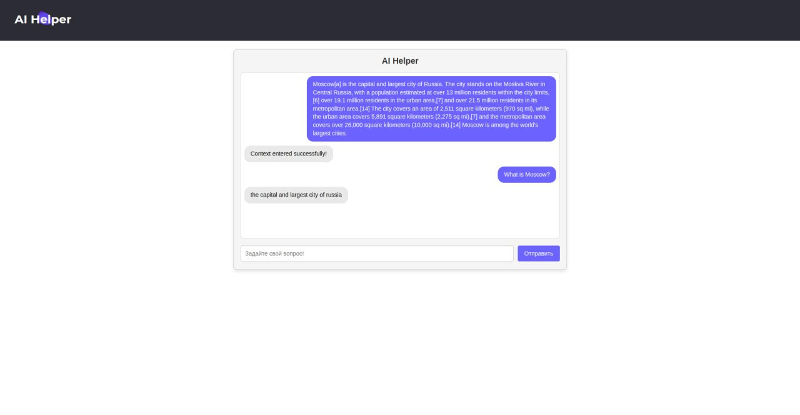
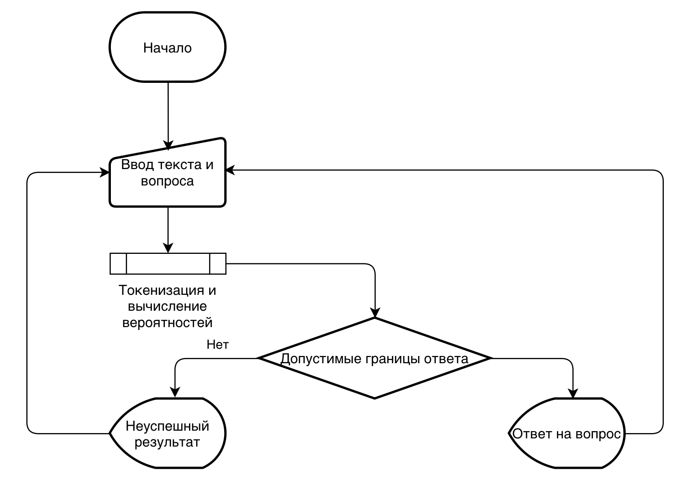

## Демонстрация функционала ПО

В результате выполнения проекта был получен программный продукт, который позволяет пользователю находить в тексте ответы на вопросы, заданные в естественном языке.

### Пример использования

Продукт представляет собой чат бота, который умеет отвечать на вопросы, заданные в естественном языке. Пользователь может задать вопрос боту, и бот попытается найти ответ на этот вопрос в тексте. В случае успеха бот выведет ответ на экран.

Пользователь может задать несколько вопросов по одному и тому же тексту, а также изменить текст, в котором бот ищет ответы.

## Пояснительная записка

### Исходный замысел проекта

Проект представляет собой программу, которая позволяет пользователю находить в тексте ответы на вопросы, заданные в естественном языке. Программа должна уметь обрабатывать тексты на русском языке.

Данная тема была выбрана, так как она является актуальной и интересной. Существует множество ситуаций, когда пользователь хочет найти ответ на свой вопрос в тексте, но не имеет времени на его прочтение. Программа, способная находить ответы на вопросы в тексте, может значительно упростить жизнь пользователя.

Актуальность данной темы состоит в используемых технологиях. Для решения задачи поиска ответов на вопросы в тексте используются методы обработки естественного языка, которые находят широкое применение в современных технологиях.

Существует множество сервисов, которые предоставляют возможность сокращенного чтения текстов, но ни один из них не предоставляет возможность быстро находить ответы на требуемые вопросы в тексте.

Подобные сервисы могут быть полезны в различных сферах деятельности, таких как образование, научные исследования, работа с большими объемами текстов и другие.

Для примера, чат бот может помочь студентам и школьникам при подготовке к экзаменам, так как формат заданий с вопросами и текстом очень популярен в образовательных учреждениях.

### Цель проекта

Целью проекта является создание программы, которая позволяет пользователю находить в тексте ответы на вопросы, заданные в естественном языке.

Проект предполагает наличие пользовательского интерфейса, который позволяет пользователю в удобном формате задавать вопросы и получать на них ответы.

### Назначение проекта

Программа предназначена для пользователей, которым необходимо быстро находить ответы на вопросы в тексте. Программа может быть полезна в различных сферах деятельности, таких как образование, научные исследования, работа с большими объемами текстов и другие.

### Ход выполнения проекта

#### Подготовительный этап

На подготовительном этапе была выбрана тема проекта и определены его цели и назначение. Был проведен анализ существующих решений и определены требования к программе.

На этом этапе был составлен план проекта, определены задачи и сроки их выполнения.

#### Аналитический этап

На аналитическом этапе были изучены методы обработки естественного языка и выбраны наиболее подходящие для решения поставленной задачи.

В качестве основного алгоритма был выбран алгоритм поиска ответов на вопросы в тексте на основе машинного обучения. Для этого была использована библиотека `transformers`.

Для работы были выбраны модель `BertForQuestionAnswering` и токенизатор `BertTokenizer`, которые позволяют обучить модель на задаче поиска ответов на вопросы в тексте.

Модель `bert-large-uncased-whole-word-masking-finetuned-squad` была выбрана, так как она показывает хорошие результаты на задачах поиска ответов на вопросы в тексте, а также имеет высокую скорость работы, что позволяет использовать ее в реальном времени, не имея больших вычислительных мощностей.

Другие модели были также рассмотрены, но они показали худшие результаты на задаче поиска ответов на вопросы в тексте.

Например, модели `albert-base-v2` и `distilbert-base-uncased-distilled-squad` показали худшие результаты на задаче поиска ответов на вопросы в тексте.

#### Этап разработки

На этапе разработки была создана программа, которая позволяет пользователю находить в тексте ответы на вопросы, заданные в естественном языке, а также пользовательский интерфейс, который позволяет пользователю в удобном формате задавать вопросы и получать на них ответы.

Программа состоит из двух частей: серверной и клиентской.

##### Серверная часть

Серверная часть программы представляет собой веб-сервер, который обрабатывает запросы от клиентской части программы и возвращает ответы на вопросы, заданные на естественном языке.

Для создания серверной части был использован язык программирования `Python` и библиотеки `transformers`, `torch`, `FastAPI`.

Для получения ответов на вопросы в тексте была использована модель `BertForQuestionAnswering`, которая была обучена на задаче поиска ответов на вопросы в тексте.

Принцип работы алгоритма поиска ответов на вопросы в тексте на основе машинного обучения заключается в следующем:

1. Текст и вопрос токенизируются с помощью токенизатора `BertTokenizer`.
2. Полученные токены подаются на вход модели `BertForQuestionAnswering`.
3. Модель возвращает вероятности того, что каждый токен является началом или концом ответа.
4. На основе вероятностей модель выбирает начало и конец ответа.
5. Полученные токены декодируются с помощью токенизатора `BertTokenizer` и возвращаются пользователю.
6. Пользователь получает ответ на свой вопрос.

Схема работы программы представлена на рисунке:

При разработке были учтены возможности кастомизации программы путем выбора другой модели или токенизатора, а также возможность добавления этапа тренировки модели на своих данных.

##### Клиентская часть

Клиентская часть программы представляет собой веб-страницу, на которой пользователь может задавать вопросы и получать на них ответы.

Для создания клиентской части был использован язык программирования `TypeScript` и библиотеки `react`, `axios`

Клиент-серверное взаимодействие происходит за счёт HTTP-запросов. Клиент отправляет `POST` запрос с телом запроса, содержащим контекстную информацию и вопрос пользователя.

Алгоритм взаимодействия с интерфейсом следующий:

1. Пользователь загружает контекстную информацию (статью, текст)
2. Сервис уведомляет клиента об успешно загруженном контексте
3. Пользователь задаёт вопросы, связанные с контекстной информацией. Сервис ожидает ответа от серверной части и визуализируется ответ после получения информации.

#### Тестирование

В рамках тестирования проекта проведено:
- Модульное тестирование с использованием модуля **unittest**
- Покрытие тестами кода с использованием **coverge report** с результатом - 85%
- Веб-тестирование производительности с помощью утилиты **wrk** на 400 соединений в течение 30 секунд - с результатом, доказывающим нормальную работу сервиса, при умеренных нагрузках
- Нагрузочное тестирование с использованием **Chrome DevTools** и проведением профайлинга: в результате на вкладке дерева вызовов отсутствуют индикаторы (красные флажки), которые указывают на неоптимизированное время выполнение и узкие места системы;
- Для тестирования GUI были использованы стандартные тесты для пользовательского интерфейса **npm-test**

### Результаты проекта

В результате выполнения проекта был создан программный продукт, который позволяет пользователю находить в тексте ответы на вопросы, заданные в естественном языке.

Программа представляет собой чат бота, который умеет отвечать на вопросы, заданные в естественном языке. Пользователь может задать вопрос боту, и бот попытается найти ответ на этот вопрос в тексте. В случае успеха бот выведет ответ на экран.

## Использование СASE-средств

CASE-средства (Computer-Aided Software Engineering) - это программные средства, предназначенные для автоматизации процессов разработки программного обеспечения.

В ходе выполнения проекта были использованы следующие CASE-средства:

1. **PyCharm** - интегрированная среда разработки для языка программирования Python.
2. **Visual Studio Code** - интегрированная среда разработки для языка программирования Python.
3. **Jupyter Notebook** - интерактивная среда разработки для языка программирования Python.
4. **GitHub** - система контроля версий и хостинг проектов.
5. **Google Drive** - облачное хранилище для хранения данных и документации проекта.
6. **Google Docs** - текстовый редактор для написания документации проекта.
7.  **Zoom** - видеоконференцсвязь для общения с командой проекта.
8.  **Telegram** - мессенджер для общения с командой проекта.
9.  **Notion** - сервис для управления задачами и проектами.

## Анализ проекта

В проекте принимали участие следующие участники:

1. **Иващенко Никита**

    Должность: разработчик

    **Вклад**

    - Разработка программы поиска ответов на вопросы в тексте
    - Интеграция предобученной модели `BertForQuestionAnswering`
    - Верстка пользовательского интерфейса
    - Интеграция серверной и клиентской части программы

2. **Култышкина Дарья**

    Должность: тестировщик

    **Вклад**

    - Тестирование программы поиска ответов на вопросы в тексте
    - Подготовка тестовых данных
    - Покрытие тестами кода проекта и проведение модульного, веб, нагрузочного, GUI тестирования
    - Анализ результатов тестирования
    - Написание отчета о тестировании

3. **Пустотин Даниил**

    Должность: менеджер проекта

    **Вклад**

    - Анализ методов обработки естественного языка
    - Выбор оптимальной модели и токенизатора
    - Проведение еженедельных синков, постановка и контроль выполнения задач
    - Написание пояснительной записки
